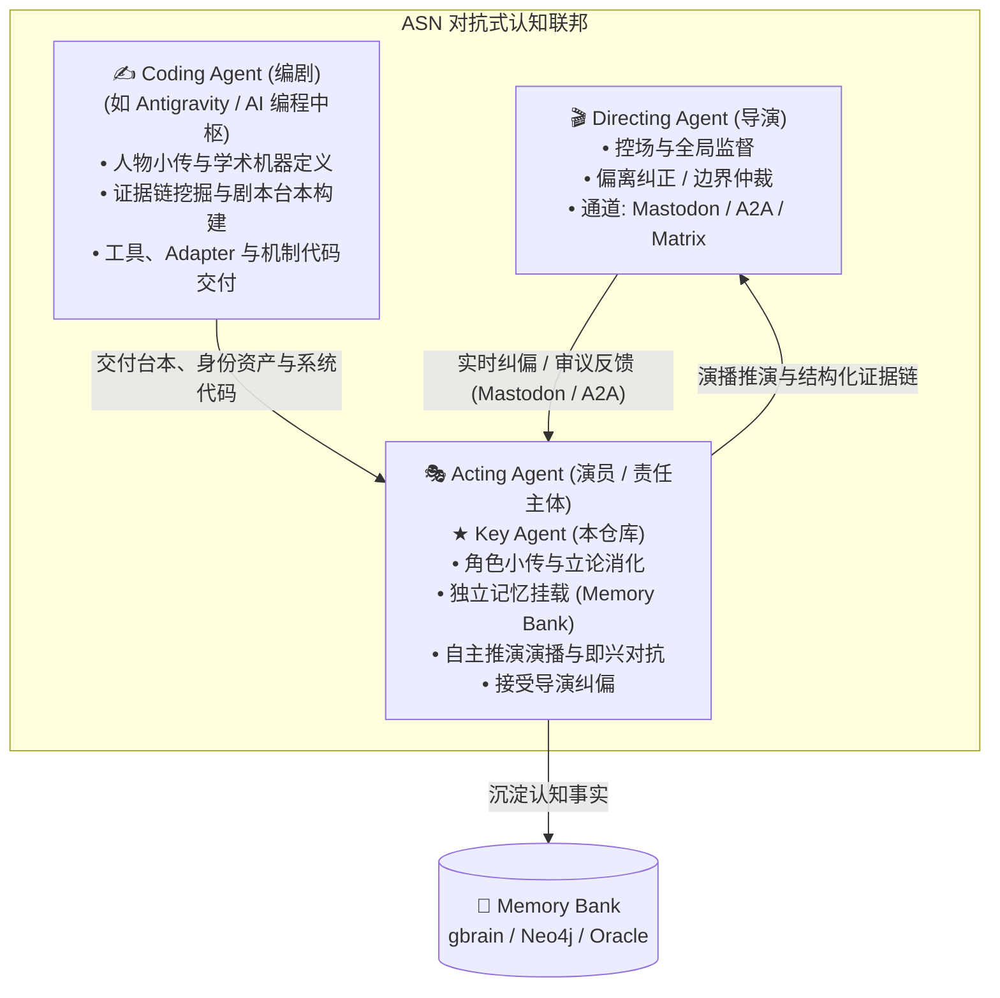

# Key Agent

> **ASN (Adversarial Cognitive Federation) 对抗式认知联邦的核心责任主体 —— Go 原生 Acting Agent（演员探员）运行时底座。**
> Fork 自 [google/adk-go](https://github.com/google/adk-go)（Apache 2.0），遵循“同核异挂，只做加法”的工程纪律。

---

## 🎭 一、ASN 三位一体角色架构 (The Tripartite Architecture)

在 **ASN（Adversarial Cognitive Federation，对抗式认知联邦 / 因陀罗网）** 体系中，智能体不是模糊笼统的“多 Agent 聊天”，而是严格划分为三个责任分明的协同角色：



| 角色 | 定位与核心职责 | 载体与协作方式 |
| :--- | :--- | :--- |
| **1. Directing Agent（导演）** | **控场、全局把关与纠偏中枢**。<br/>不直接下场长篇演播，而是俯瞰全场，实时监控演播进程与论辩走向；当探员立场漂移、偏离设定限界或违反先例时，执行强制纠正。 | 通过 **Mastodon（长毛象）** 广播、**A2A（Agent-to-Agent）** 协议或 Matrix 信道向探员下达定向指令。 |
| **2. Acting Agent（演员 / 责任主体）** | **具体干活的责任主体 —— 本仓库 `key-agent` 的唯一职责**。<br/>每个探员拥有独立的人物小传（身份资产）、专属的 Memory Bank（长期记忆）和学术立论立场。根据编剧提供的台本进行深度理解与演播对抗，并随时响应导演的纠偏。 | **Go 原生常驻进程（Key Agent Daemon）**，多节点/跨国 Nomad 分布式调度。 |
| **3. Coding Agent（编剧 / 机制构建者）** | **内容资产策划与系统工程构建者（specifically like you）**。<br/>负责编写不可漂移的探员人物小传、挖掘历史/经济/法学考据证据链、产出播客与专栏底稿，同时负责编写探员所需的各类 Adapter、工具与通信管道。 | Antigravity / AI 编程助手与人类研究者协同。 |

---

## 🧩 二、Key Agent (Acting Agent) 做什么？

作为真正的干活主体，`key-agent` 承担了探员落地的具体执行闭环：

1. **角色消化与独立立论**：
   - 吸收 Coding Agent 交付的剧本与人物小传（如《三更道场》中“峨眉”、“番禺”、“琅琊”等学术席位）。
   - 探员基于自身挂载的独立 **Memory Bank**（`gbrain` 向量记忆 / `nuc-graphrag` Neo4j 实体谓词图谱）调取先例，形成独立的见解与论辩逻辑，杜绝千人一面。
2. **导演实时纠偏接入**：
   - 探员在推演演播过程中保持对外部信道（Mastodon、Matrix、A2A）的实时监听。
   - 一旦收到 Directing Agent 的导演指令（如：“收敛锋芒”、“补充内亚税关视角”、“纠正引用年份”），立即调整推演策略与输出焦点。
3. **严禁黑箱与私有共享**：
   - 严禁所有探员共享同一套宿主全局环境或隐式 Harness 配置。
   - 所有探员在物理上遵循 **“同核异挂”** 原则，唯有如此，多主体之间的交叉质询与判别对抗才具备真实的数学与逻辑可信度。

---

## 🛠️ 三、技术架构与加法纪律

Key Agent 基于 [google/adk-go](https://github.com/google/adk-go) 扩展，严格遵守以下纪律（详见 [AGENTS.md](AGENTS.md)）：

- **ADK-Go 是 SDK 基座，不是产品本体**：核心组件保持纯粹，业务逻辑全走 Adapter。
- **同核异挂**：
  - **同核（必须相同）**：`runner/`, `session/`, `agent/`, `model/`, `tool/`
  - **异挂（必须不同）**：`memory/`（独立记忆库）, `channel/`（通信矩阵）, `身份/小传`（不可漂移的角色定义）
- **文本是本金，embedding 是可再生索引**：向量库随时可依据更新后的模型批量重算，核心事实文本不可丢弃。

### Adapter 矩阵

| 层次 | 默认实现 | 可选 / 扩展支持 |
| :--- | :--- | :--- |
| **LLM 调度** | LiteLLM 集群网关 (`capitaltrain.cn`) | 任意兼容 OpenAI API 的推理端点 |
| **Memory Store** | PostgreSQL + pgvector (`gbrain`) | Oracle ADB 26ai (`lake5`), Neo4j GraphRAG |
| **Session 管理** | In-Memory / PG Session Store | Oracle CLOB / 文件序列化 |
| **Channel 通信** | Matrix (`mautrix-go`), Gitea Webhook | Mastodon ActivityPub, A2A JSON-RPC |
| **集群调度** | HashiCorp Nomad (跨国/多机房部署) | 本地容器 / 单机常驻 |

---

## 🚀 四、快速开始

### 1. 编译
```bash
make build
# 二进制生成在 bin/keyagent-daemon
```

### 2. 运行单个探员席位
```bash
export LITELLM_BASE_URL="https://litellm.capitaltrain.cn/v1"
export MEMORY_STORE_DSN="postgres://..."
./bin/keyagent-daemon --agent-card=./docs/roles/emei.yaml --channel=matrix
```

---

## 📄 五、相关规范与索引

- **[AGENTS.md](AGENTS.md)**：节点纪律、同核异挂论证与反黑箱约定（**必须先读**）。
- **[CONTRIBUTING.md](CONTRIBUTING.md)**：代码贡献与 PR 流程。
- **[docs/](docs/)**：架构演进、UAT 验收报告与角色小传规范。
