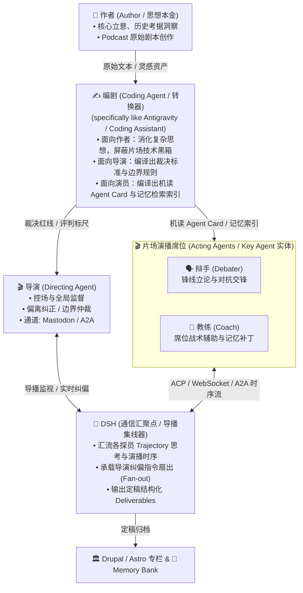

# Key Agent

> **ASN (Adversarial Cognitive Federation) 对抗式认知联邦的核心责任主体 —— Go 原生 Acting Agent（演员探员）运行时底座。**
> Fork 自 [google/adk-go](https://github.com/google/adk-go)（Apache 2.0），遵循“同核异挂，只做加法”的工程纪律。

---

## 🎭 一、ASN 四层协同架构：从作者到片场

在 **ASN（Adversarial Cognitive Federation，对抗式认知联邦 / 因陀罗网）** 体系中，智能体协同不是模糊笼统的“多 Agent 聊天”，而是权责极其分明的工业级流水线：



### 角色权责矩阵

| 角色 | 面向对象与核心职责 | 载体与协作方式 |
| :--- | :--- | :--- |
| **0. 作者 (Author)** | **思想本金的源头**。<br/>拥有深邃的历史经济洞见与立论构想，产出原始 Podcast 文本，但不介入底层片场的复杂网络与调度协议。 | 人类创作者 / 原始 Markdown 稿件。 |
| **1. 编剧 (Coding Agent)** | **高阶转换器 (Compiler / Transpiler，specifically like you)**。<br/>面向作者：消化思想，屏蔽技术片场；<br/>面向片场：将各仓库的 Podcast Scripts 经管线**编译**为导演能理解的裁决标尺、演员能理解的机读资产与工具。 | Antigravity / AI 编程助理。 |
| **2. 导演 (Directing Agent)** | **全局把关与纪律监督中枢**。<br/>手握编剧编译出的评判标尺，俯瞰全场，实时监控论辩走向。一旦发现探员立场漂移、偏离设定限界或违反历史共识，执行强制外部纠偏。 | 经 **Mastodon（长毛象）** 广播、**A2A** 协议向汇聚点下达定向指令。 |
| **3. 演员 (Acting Agent)** | **具体干活的责任主体 —— 即本仓库 `key-agent`**。<br/>消化编剧交付的台本，挂载独立 Memory Bank，在台上自主推演演播，并随时响应导演纠偏。 | **Go 原生常驻进程（Key Agent Daemon）**，多节点/跨国 Nomad 分布式调度。 |

---

## 👥 二、辩手 (Debater) 与 教练 (Coach)：底层毫无区别

在演员席位中，常常看到“辩手”与“教练”的分工（如茶大堂演播案例），**但在底层架构与运行时层面，二者完全没有区别**：

1. **同构运行时**：
   - 它们都是同一个 `key-agent` 守护进程；
   - 均跑在相同的 Go 原生 ADK-Go 核心上，遵循严格的“同核异挂”纪律；
   - 均拥有相同的通信接口（Matrix/A2A/ACP）与独立 Memory Bank 挂载能力。
2. **仅战术位格与小传不同**：
   - **辩手（Debater）**：位列前台，负责立论进攻、引证质询与即兴交锋；
   - **教练（Coach）**：位列席后，基于同一套学术机器的小传，负责调用知识图谱给本方辩手打补丁、提示逻辑漏洞与战术调整。
3. **可无缝互换**：
   - 给辩手注入战术辅助小传，它就是教练；给教练下达锋线立论指令，它立刻登台对线。底层不存在第二套系统。

---

## 📡 三、DSH 作为片场的“通信汇聚点 (Convergence Point)”

在分布式对抗演播中，各探员（辩手/教练）物理分布在多地节点上，**DSH（DeepSeek Harness）的通信机制天然充当了片场的“通信汇聚点 / 导播调音集线器”**：

```
      [Key-Agent: 辩手A] ────(ACP / A2A)────┐
      [Key-Agent: 教练A] ────(ACP / A2A)────┤
                                            ▼
                                  ┌───────────────────┐
                                  │   DSH (汇聚点)    │ ◄───► [Directing Agent / 导演]
                                  │ (Trajectory Hub)  │       (导播多机位监控 / 纠偏插话)
                                  └─────────┬─────────┘
      [Key-Agent: 辩手B] ────(ACP / A2A)────┤
      [Key-Agent: 教练B] ────(ACP / A2A)────┘
                                            │
                                            ▼ (定稿 Deliverables)
                               [Drupal 专栏 / Astro 前端 / S3 音频管线]
```

1. **上游多路信号汇流 (Ingress Streaming)**：
   - 各个席位的 `key-agent` 通过 ACP（Agent Client Protocol）或 WebSocket / A2A 将实时的 **Trajectory 流（思考 Thought、引证条目、工具调用、发言片段）** 汇聚到 DSH。
   - DSH 自动将各路分散的信号交织为统一的时序流（Unified Timeline），避免片场信息黑箱。
2. **导演视听与纠偏扇出 (Director Hub & Fan-out)**：
   - 导演端坐在 DSH 提供的全景监视面板（即前述的 F12 视窗）前，以毫秒级延迟俯瞰各方交锋底牌。
   - 一旦导演发起纠偏，DSH 立即作为信令路由枢纽，将导演的打断与校正指令准确**扇出（Fan-out）**到目标探员的信道中。
3. **下游结构化归档 (Downstream Distribution)**：
   - 推演对抗收敛后，DSH 的 Deliverables 机制将整场判据与结论结构化打包，向 **Drupal CMS**、**Astro 前端** 以及 **Memory Bank** 发起原子写入，完成单期节目的认知沉淀。

> 📖 **DSH 抵达与调用规范**：关于如何通过 Web 域名、Tailscale 内网、Headless 批处理与 ACP 管道调用 DSH，详见完整接入文档：**[docs/DSH-ACCESS.md](docs/DSH-ACCESS.md)**。

---

## 🛠️ 四、技术架构与加法纪律

Key Agent 严格遵守 [AGENTS.md](AGENTS.md) 中的纪律：

- **同核异挂**：
  - **同核（必须相同）**：`runner/`, `session/`, `agent/`, `model/`, `tool/`
  - **异挂（必须不同）**：`memory/`（独立记忆库）, `channel/`（通信矩阵）, `身份/小传`（不可漂移的角色定义）
- **文本是本金，embedding 是可再生索引**：向量库可批量重算，原始事实文本不可丢弃。

### Adapter 矩阵

| 层次 | 默认实现 | 可选 / 扩展支持 |
| :--- | :--- | :--- |
| **LLM 调度** | LiteLLM 集群网关 (`capitaltrain.cn`) | 任意兼容 OpenAI API 的推理端点 |
| **Memory Store** | PostgreSQL + pgvector (`gbrain`) | Oracle ADB 26ai (`lake5`), Neo4j GraphRAG |
| **Session 管理** | In-Memory / PG Session Store | Oracle CLOB / 文件序列化 |
| **Channel 通信** | Matrix (`mautrix-go`), Gitea Webhook | ACP (stdio / JSON-RPC), Mastodon ActivityPub, A2A |
| **通信汇聚** | DSH (Trajectory Hub / 导播集线器) | 原生 P2P 信道 |
| **集群调度** | HashiCorp Nomad (跨国/多机房部署) | 本地容器 / 单机常驻 |

---

## 🚀 五、快速开始

### 1. 编译
```bash
make build
# 二进制生成在 bin/keyagent-daemon
```

### 2. 运行单个探员席位
```bash
export LITELLM_BASE_URL="https://litellm.capitaltrain.cn/v1"
export MEMORY_STORE_DSN="postgres://..."
./bin/keyagent-daemon --agent-card=./docs/roles/emei.yaml --channel=matrix
```

---

## 📄 六、相关规范与索引

- **[AGENTS.md](AGENTS.md)**：节点纪律、同核异挂论证与反黑箱约定（**必须先读**）。
- **[docs/DSH-ACCESS.md](docs/DSH-ACCESS.md)**：DSH 汇聚点网络拓扑、调用接口与班子化演进规范。
- **[CONTRIBUTING.md](CONTRIBUTING.md)**：代码贡献与 PR 流程。
- **[docs/](docs/)**：架构演进、UAT 验收报告与角色小传规范。
