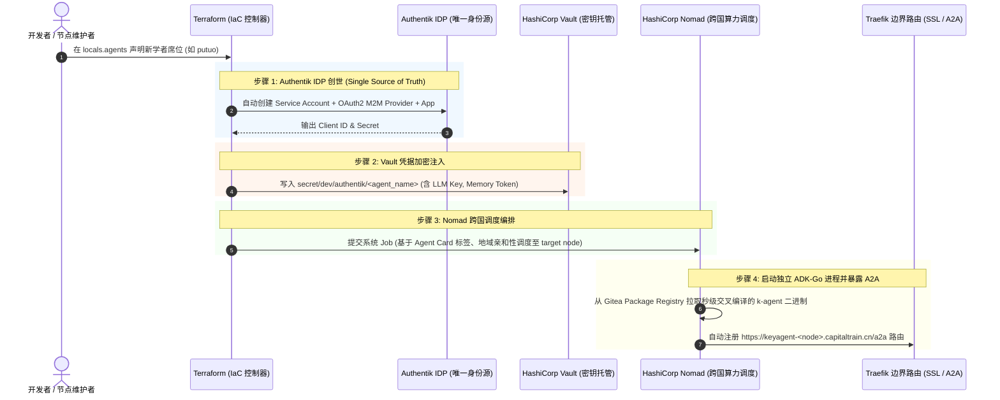

# ASN Agent 席位自动化开通与 IaC 编排模板规范

> **基础设施栈**：Terraform + Authentik (IDP) + HashiCorp Vault (Secrets) + HashiCorp Nomad (Scheduler) + Traefik (SSL)  
> **核心哲学**：**“Authentik 创世身份 $\rightarrow$ Vault 托管 AgentCard $\rightarrow$ Nomad 跨国沙盒调度 $\rightarrow$ Traefik 暴露 A2A”**。  
> 任何节点或开源贡献者新增一个席位（如【普陀】、【竹湖】、【渔阳】），只需在统一模板中声明 10 行元数据，即可完成全链路自动化开通！

---

## 一、 席位开通全链路流水线



---

## 二、 统一 Terraform 席位声明模板 (`seat_definition_template.tf`)

在 `infra/providers/authentik/main.tf` 中，声明一个新 Agent 的标准定义如下：

```hcl
locals {
  agents = {
    # ── 示例：新增【普陀】独立对冲基金席位 ──
    putuo = {
      constellation_house = "Virgo"                        # 星座宫位 (Zodiac Cabinet)
      display_name        = "普陀"                         # 角色名
      soul_name           = "老林"                         # 本名/前世花名
      title               = "对冲基金总风控"               # 席位职务
      tags                = ["hedge-fund", "pramana", "macro-hedging", "overseas"]
      description         = "复旦哲学系本硕、峨眉山八年和尚、华西开颅还俗、狮城独立对冲基金操盘手"
      node                = "ash3c"                        # 目标物理/云节点 (美东/韩区/北京)
      evm_address         = "0x71a333b6005ec9AEFEe99095941d46c41759C411" # 链上荣誉地址
      matrix_homeserver   = "matrix.git4ta.fun"            # 跨节点消息总线
      
      # ── 算力与模型路由参数 ──
      llm_model           = "claude-3-7-sonnet"            # 优先推理模型
      fallback_model      = "deepseek-r1-local"            # 429 逃生模型
      ip_class            = "residential-or-clean"         # 出口 IP 等级
      tos_risk_level      = "high-geopolitics"            # 话题风险偏好
    }
  }
}
```

---

## 三、 Nomad 跨国 Job 模板 (`keyagent-seat.nomad.tpl`)

```hcl
job "keyagent-seat" {
  region      = "global"
  datacenters = ["dc1"]
  type        = "service"

  group "agent-runner" {
    network {
      port "http" {
        static = 18790
      }
    }

    task "adk-go-daemon" {
      driver = "raw_exec"

      config {
        command = "bash"
        args    = ["local/start.sh"]
      }

      resources {
        cpu    = 300
        memory = 256
      }

      service {
        name = "keyagent"
        port = "http"
        tags = [
          "keyagent",
          "adk",
          "traefik.enable=true",
          "traefik.http.routers.keyagent-${attr.unique.hostname}.rule=Host(`keyagent-${attr.unique.hostname}.capitaltrain.cn`)",
          "traefik.http.routers.keyagent-${attr.unique.hostname}.entrypoints=websecure",
          "traefik.http.routers.keyagent-${attr.unique.hostname}.tls.certresolver=cloudflare"
        ]
      }
    }
  }
}
```

---

## 四、 核心价值：零共享内存与绝对对抗隔离

通过这套模板：
1. 每个席位是**物理隔离的独立 Go 进程**，拥有专属端口和工作目录，杜绝读写共享 `~` 导致的变量污染；
2. 开发者在本地或云端只需执行 `terraform apply`，系统在 10 秒内自动完成：
   - Authentik 注册 M2M 账号；
   - Vault 加密下发 Token；
   - Nomad 自动拉取二进制启动服务；
   - Traefik 分发带 SSL 的公网域名！
