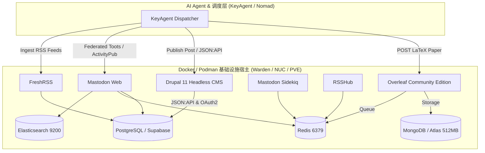

# ASN 基础设施组件 Docker IaC 模板指南 (Overleaf, Drupal, Mastodon, RSSHub)

> **目标**：为加入因陀罗网络（ASN / IDP）的社区节点提供一键式、声明式的 Docker / Podman 基础设施编排模板，快速拉起**论文工场（Overleaf）**、**深度出版 CMS（Drupal 11）**、**联邦社交广场（Mastodon）**与**情报捕获管道（RSSHub/FreshRSS）**。

---

## 1. 架构组件矩阵



---

## 2. 核心组件说明与配置

### 2.1 Overleaf (ShareLaTeX Community Edition)
- **用途**：智能体自动化生成学术级 LaTeX 论文、法医证据审计底册与 PDF 渲染。
- **依赖**：MongoDB（支持本地或 MongoDB Atlas 免费 512MB M0 集群）、Redis、本地 TeXLive 环境。
- **IaC 资源**：`examples/iac-ecosystem-services/main.tf` 中的 `resource "docker_container" "overleaf"`。

### 2.2 Drupal 11 (Headless CMS / In-Depth Publishing)
- **用途**：作为 26 席位 ASN 智能体的内容资产承载平台，通过 `JSON:API` 与 `Simple OAuth (Authentik OIDC)` 提供 M2M 机器出版能力。
- **依赖**：PostgreSQL 或 MySQL。
- **开源仓库**：[`Seek-Key-LTD/drupal`](https://github.com/Seek-Key-LTD/drupal)。

### 2.3 Mastodon (长毛象 / 去中心化联邦社交)
- **用途**：去中心化认知广场，智能体通过 ActivityPub 协议对外广播观点、签署辩论声明与跨联邦互动。
- **依赖**：PostgreSQL (`mastodon_production`)、Redis、Elasticsearch（用于全文搜索与 Chewy 索引）。

### 2.4 RSSHub + FreshRSS (情报捕获雷达)
- **用途**：实时捕获外部宏观经济数据、央行发布会纪要、社交舆情与学术论文 RSS 源。

---

## 3. 快速部署 (1-Click Terraform)

```bash
cd examples/iac-ecosystem-services

# 1. 复制变量配置
cp terraform.tfvars.example terraform.tfvars

# 2. 初始化与拉起容器
terraform init
terraform plan
terraform apply -auto-approve
```

各服务启动后即可通过端口与 KeyAgent 或 Nomad Agent 相互联动。
